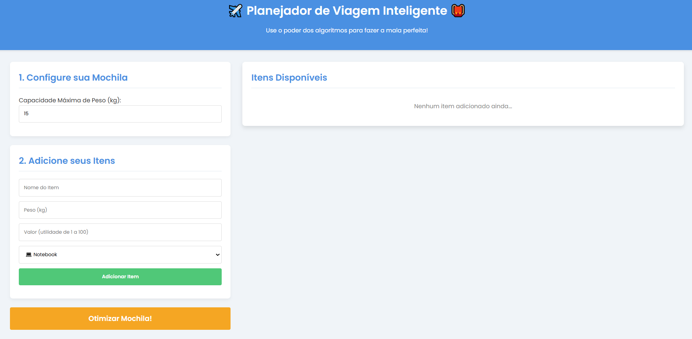
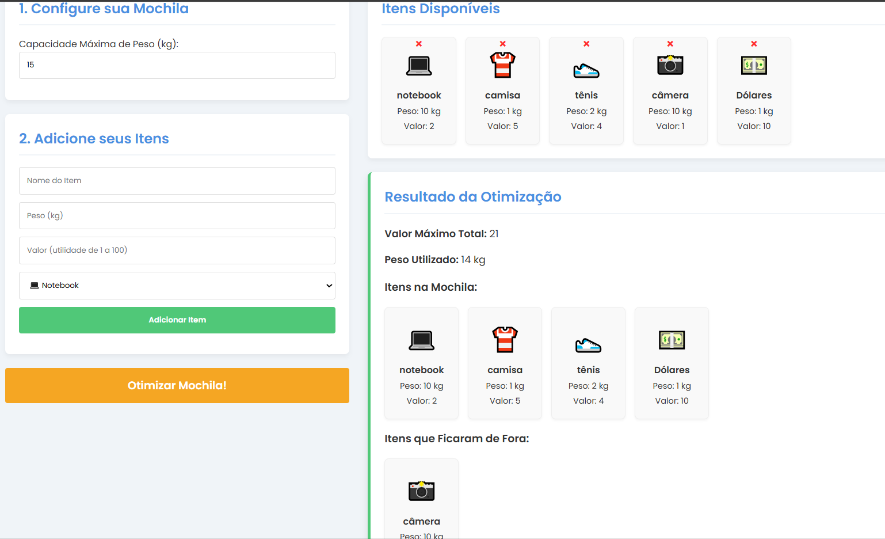
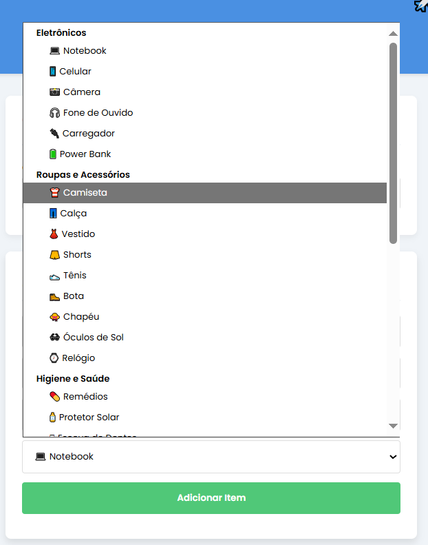

# Planejador de Viagem

**Número da Lista**: X<br>
**Conteúdo da Disciplina**: Programação Dinâmica<br>

## Alunos

|Matrícula | Aluno |
| -- | -- |
| 222015248  |  Rafael Gomes Pereira |
| 222025324  |  João Lucas Araujo Siqueira |


## Sobre 
Este projeto é o Planejador de Viagem Inteligente, uma aplicação web interativa desenvolvida para resolver o clássico Problema da Mochila (Knapsack Problem) de forma prática e visual. Utilizando um algoritmo de programação dinâmica, a ferramenta ajuda o usuário a fazer a mala perfeita, calculando a combinação de itens que maximiza o valor total (utilidade) sem ultrapassar a capacidade de peso definida. O usuário pode configurar sua mochila, adicionar itens com seus respectivos pesos e valores e, com um clique, o sistema exibe a seleção otimizada, mostrando quais itens foram escolhidos e quais ficaram de fora. O objetivo é transformar um complexo problema de otimização em uma solução acessível e funcional para o planejamento de viagens. 

## Screenshots
<center>

<p>
  
  <br>
  <sub>Página Inicial do projeto</sub>
</p>

---

<p>
  
  <br>
<sub>Mochila otimizada pelo algoritmo de Knapsack</sub>
</p>

---

<p>
  
  <br>
<sub>lista de acessórios para se colocar na mochila</sub>
</p>

---

</center>


## Vídeo da Apresentação

[Assistir Apresentação](https://youtu.be/daKIC_K51Dc)

### Pré-requisitos

- Git
- Navegador

---

**Linguagem**: Javascript <br>

**Framework**: Não foi utilizado nenhum framework<br>

**Pré-requisitos:** Git e navegador instalados.<br>

Para executar o projeto localmente, basta clonar o repositório e abrir o arquivo _index.html_, que a aplicação será aberta em seu navegador padrão:


```bash
git clone https://github.com/projeto-de-algoritmos-2025/PD_Planejador-Viagem.git
```

Para acessar o projeto online, acesse o site:
[Planejador_de_Viagem](https://github.com/projeto-de-algoritmos-2025/PD_Planejador-Viagem)

---

## Uso 
- 🎒 Configure sua Mochila: defina a capacidade máxima de peso que sua bagagem pode suportar no primeiro campo.

- ➕ Adicione seus Itens: preencha o formulário com o nome, peso e o valor de utilidade de cada item que você pretende levar na viagem.

- 🚀 Otimize a Bagagem: clique no botão "Otimizar Mochila!" para que o algoritmo de programação dinâmica encontre a combinação perfeita de itens.

- 📊 Analise o Resultado: visualize o valor máximo e o peso total da sua mala otimizada, e confira a lista de itens que foram selecionados e os que ficaram de fora.
---


